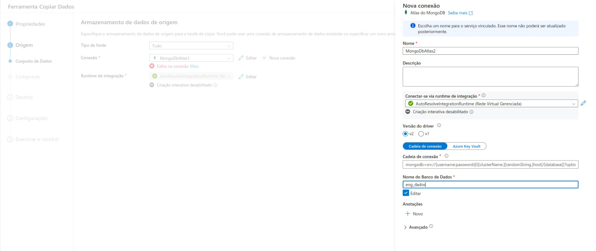
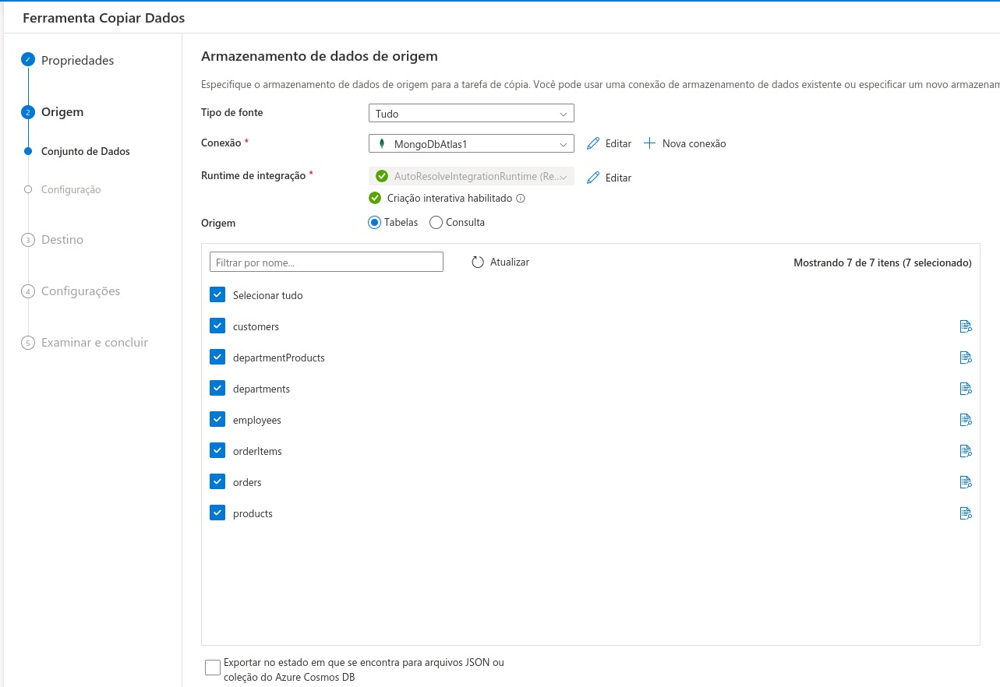
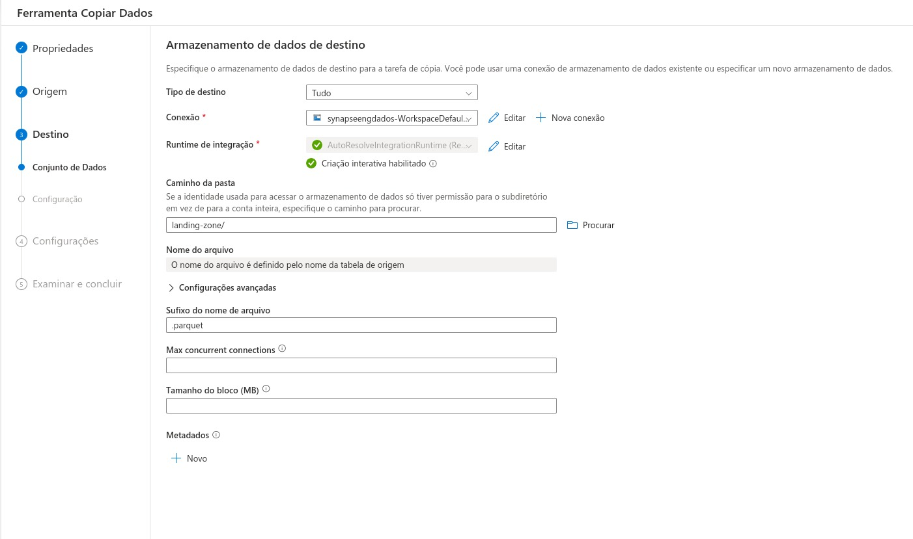
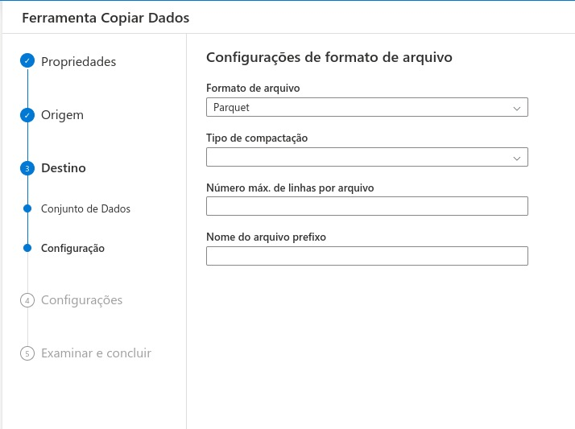
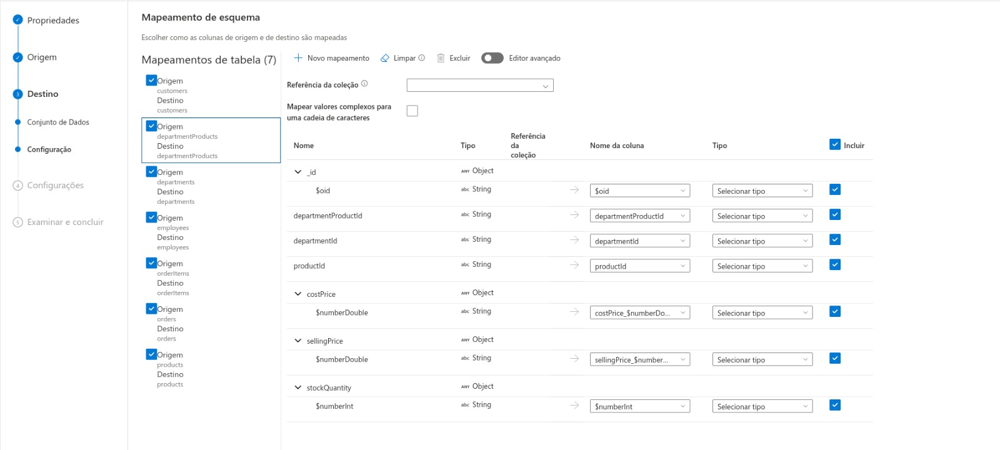
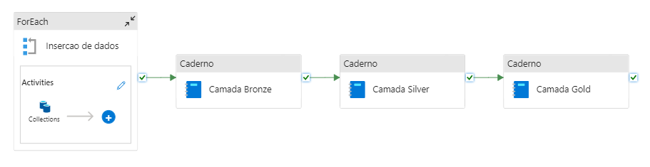

# Orquestração

## Descrição

Azure Synapse é utilizado para processar e analisar grandes volumes de dados. Ele oferece um ambiente unificado para ingestão, preparação, gerenciamento e entrega de dados para BI e machine learning.

## Objetivo

O objetivo do Azure Synapse no projeto é fornecer uma plataforma robusta para processamento e transformação de dados, além de armazenar os dados processados em diferentes camadas (Bronze, Silver, Gold).

## Processos

### Pipeline de Dados

1. **Ingestão de Dados**: Dados brutos são exportados do MongoDB e ingeridos no Azure Synapse.
2. **Transformação Inicial (Bronze)**: Conversão de dados brutos em formatos estruturados.
3. **Limpeza de Dados (Silver)**: Remoção de duplicatas, correção de erros e preenchimento de valores ausentes.
4. **Refinamento de Dados (Gold)**: Criação de métricas e agregações para análise final.

## MongoDB no Synapse

### Siga os passos a seguir

#### 1 - Conexão com o Atlas MongoDB

#### 2 - Selecionar as collections

#### 3 - Selecione o destino, que neste caso é o Data Lake. Em seguida, escolha o container "landing-zone" dentro do Data Lake e defina o formato final do arquivo como .parquet

#### 4 - Selecionar formato do arquivo como "Parquet"

#### 5 - Selecionar colunas das tabelas de origens e definir seus tipos de dados

## Exemplo de fluxo

Fluxo da pipeline de dados
Primeiro, o loop "for each" percorre um array contendo todas as collections selecionadas, inserindo-as individualmente. Após a conclusão bem-sucedida dessa etapa, a pipeline continua e passa pelas camadas bronze, silver e gold.

[Voltar para a página inicial](index.md)
