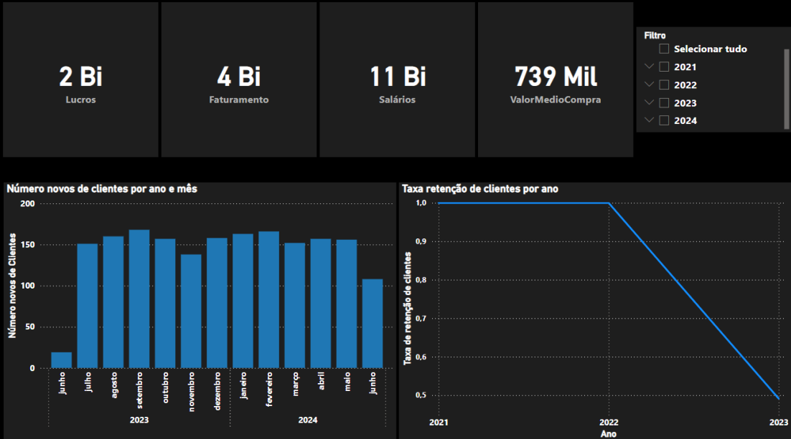

# Power BI

## Descrição

O Power BI é utilizado para visualizar e analisar os dados refinados da camada Gold. Ele permite a criação de dashboards interativos e relatórios detalhados para tomada de decisão.

## Objetivo

O objetivo do Power BI no projeto é fornecer uma plataforma de visualização de dados onde usuários podem explorar e interagir com os dados refinados para obter insights valiosos.

## Processos

### Conexão ao Azure Synapse

1. **Importação de Dados**:
    - Conecte-se ao Azure Synapse diretamente do Power BI.
    - Importe as tabelas refinadas da camada Gold para o Power BI.

2. **Modelagem de Dados**:
    - Crie relacionamentos entre tabelas.
    - Defina medidas e colunas calculadas para análise.

### Exemplos de Dashboards

#### Dashboard de Vendas

- **KPIs (Indicadores-Chave de Desempenho)**:
    -- Exibe o totais de Lucros, Faturamento, Salários e Valor médio de Compra.
- **Gráficos**:
    -- Número deeovos clientes por ano e mês
    -- Taxa de retenção de cliente por ano

### Exemplos de Visualizações

## Ferramentas Utilizadas

- **Power BI Desktop**: Para desenvolvimento de dashboards e relatórios.
- **Power BI Service**: Para publicação e compartilhamento de dashboards e relatórios.
- **Conectores do Power BI**: Para integração com Azure Synapse e outras fontes de dados.

[Voltar para a página inicial](index.md)
